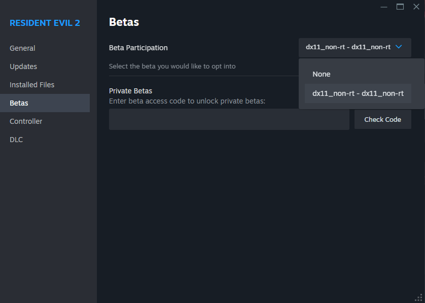

# RE2R AP Client
Archipelago randomizer client for Resident Evil 2 Remake, designed to work with the RE2R apworld here: https://github.com/FuzzyGamesOn/RE2R_AP_World/releases

## IMPORTANT / READ FIRST

**READ THE INSTALL STEPS BELOW. YOU WILL LIKELY END UP WITH SOMETHING BROKEN IF YOU DON'T.**

Also, important tips:
- Don't use typewriter teleports to skip either the Helicopter or the Mr. X arrival scenes, or to leave/skip any of the G fights. **YOU WILL HARDLOCK.**
- Don't enter any non-Ada cutscenes while Ada is following you. **YOU WILL HARDLOCK.**
- Do not switch save files when playing the same seed, or you may lose items.
- Save often. Save after boss fights.

## Install Steps

1. **THIS ONLY WORKS WITH THE non-RTX (i.e., non Ray Tracing) BETA OF RE2R ON STEAM. TO SWITCH TO THAT, RIGHT-CLICK THE GAME IN STEAM AND DO THIS:**

2. Download REFramework from the most recent release here: https://github.com/praydog/REFramework/releases
    - Get the RE2_TDB66 zip for the non Ray Tracing version (that's what non-RTX stands for, in case this is unclear).
3. Extract the REFramework zip in your RE2 game folder (Steam or otherwise)
    - Once you've done this, you should have an reframework folder in your game folder, and it should've added a dinput8.dll to the game folder.
4. Download the source for this client via the [Releases page](https://github.com/FuzzyGamesOn/RE2R_AP_Client/releases), extract that zip somewhere, and copy both the "reframework" folder and the lua-apclientpp.dll file into your game folder.
    - It may ask to overwrite or merge on the "reframework" folder, just click Yes.
5. That's it for the prep! Now start the game, and you should see some REFramework windows pop up while the game loads to the title screen.
6. In the window that says "Archipelago Client for REFramework", enter your connection details and connect. If done correctly, it should update the "Archipelago Game Mod" window with the Scenario and Difficulty that you generated.
7. Enjoy! :D

## Help, I found a bug!

Report bugs in the Issues tab here in GitHub, and we'll get to them when we can!

## I need general help.

We have a Discord thread dedicated to this rando! Join the Archipelago After Dark server here and look for the RE2R thread: https://discord.gg/Sbhy4ykUKn
